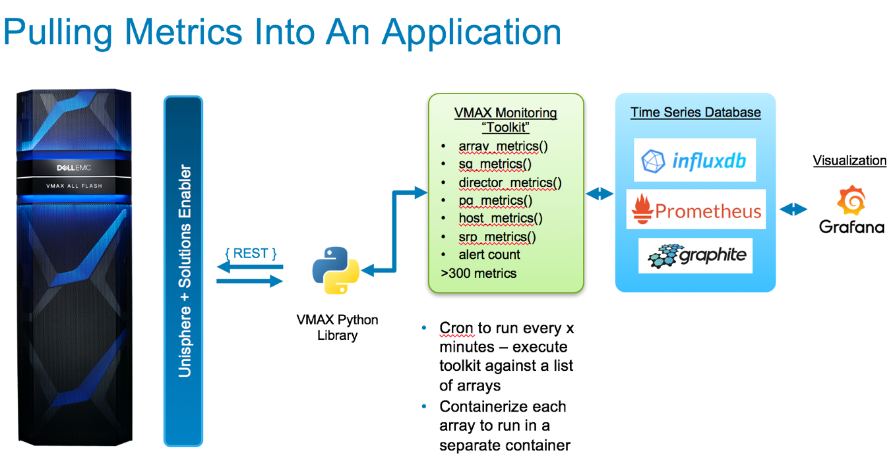

# VMAX Monitoring Toolkit
VMAX Monitoring using InfluxDB and Grafana

Uses the PyU4V library for VMAX
https://github.com/ciarams87/PyU4V

InfluxDB time-series database
https://www.influxdata.com/

Also requires the InfluxDB Python library
https://github.com/influxdata/influxdb-python

Grafana for visualization
https://grafana.com/

### Sample InfluxDB data set

'vmaxdb_example.tar.gz' contains a synthetically generated InfluxDB VMAX data set named 'vmaxdb' containing data from 4/12/18 - 5/24/18. It is backed up as an InfluxDB 'portable' backup. To restore this database to InfluxDB use the following example:

1. Extract the .tar.gz file to a folder, e.g. vmaxdb_backup, on the InfluxDB server
2. Run the following command:
```
influxdb restore -portable -db vmaxdb -newdb vmaxdb_demo ./vmaxdb_backup
```
That will restore 'vmaxdb' to an InfluxDB database named 'vmaxdb_demo'

### Grafana dashboard screenshot




